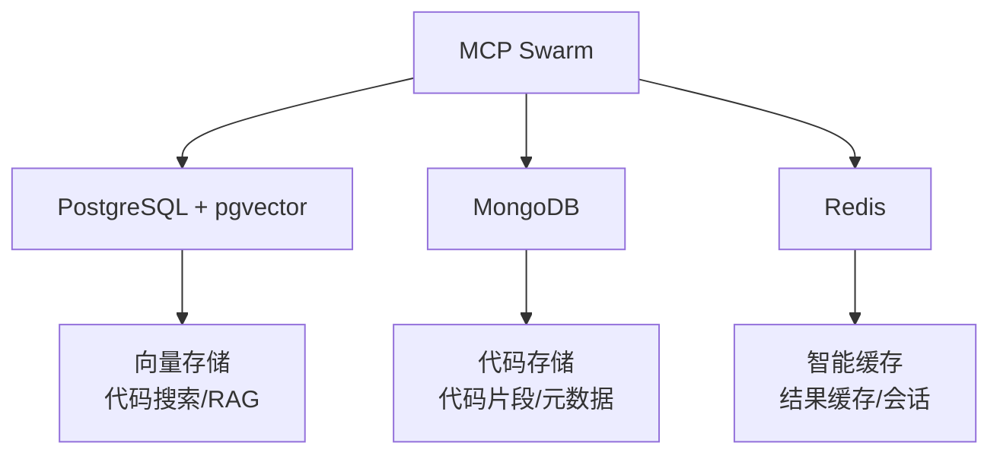

# 数据库配置指南

**日期**: 2026-02-25  
**状态**: ✅ 完成

---

## 📊 数据库架构

MCP Swarm 使用三种数据库来支持不同的功能：



### PostgreSQL (pgvector)
- **用途**: 向量存储、代码相似度搜索、RAG
- **扩展**: 需要 pgvector 扩展
- **表**: vectors (代码向量)

### MongoDB
- **用途**: 代码存储、元数据管理
- **集合**: code (代码文档)
- **索引**: filePath, language, gitHash, embeddings

### Redis
- **用途**: 智能缓存、结果缓存、会话存储
- **功能**: TTL 过期、批量操作

---

## 🔧 安装要求

### PostgreSQL (12+)

```bash
# Ubuntu/Debian
sudo apt install postgresql postgresql-contrib

# 安装 pgvector
cd /tmp
git clone https://github.com/pgvector/pgvector.git
cd pgvector
make
sudo make install

# 启用扩展
psql -d mcp_swarm -c "CREATE EXTENSION vector;"
```

### MongoDB (5.0+)

```bash
# Ubuntu/Debian
wget -qO - https://www.mongodb.org/static/pgp/server-5.0.asc | sudo apt-key add -
echo "deb [ arch=amd64,arm64 ] https://repo.mongodb.org/apt/ubuntu focal/mongodb-org/5.0 multiverse" | sudo tee /etc/apt/sources.list.d/mongodb-org-5.0.list
sudo apt-get update
sudo apt-get install -y mongodb-org
```

### Redis (6.0+)

```bash
# Ubuntu/Debian
sudo apt install redis-server

# 验证
redis-cli ping
# 应返回：PONG
```

---

## ⚙️ 配置步骤

### 1. 复制环境变量文件

```bash
cd E:\app\mcp-swarm
copy .env.example .env
```

### 2. 编辑 .env 文件

```bash
# 编辑 .env 文件，配置数据库连接
```

#### PostgreSQL 配置
```env
DB_POSTGRESQL_HOST=localhost
DB_POSTGRESQL_PORT=5432
DB_POSTGRESQL_DATABASE=mcp_swarm
DB_POSTGRESQL_USER=postgres
DB_POSTGRESQL_PASSWORD=your-password
```

#### MongoDB 配置
```env
DB_MONGODB_URI=mongodb://localhost:27017
DB_MONGODB_DATABASE=mcp_swarm
```

#### Redis 配置
```env
DB_REDIS_HOST=localhost
DB_REDIS_PORT=6379
# 可选：Redis 密码
# DB_REDIS_PASSWORD=your-password
```

### 3. 创建数据库

#### PostgreSQL
```sql
-- 创建数据库
CREATE DATABASE mcp_swarm;

-- 连接数据库
\c mcp_swarm;

-- 启用 pgvector 扩展
CREATE EXTENSION IF NOT EXISTS vector;
```

#### MongoDB
```javascript
// MongoDB 会自动创建数据库
use mcp_swarm
```

#### Redis
```bash
# Redis 不需要创建数据库，直接使用即可
redis-cli
```

### 4. 验证连接

```bash
# PostgreSQL
psql -h localhost -U postgres -d mcp_swarm

# MongoDB
mongosh mongodb://localhost:27017/mcp_swarm

# Redis
redis-cli ping
```

---

## 🚀 使用方式

### 在 MCP 中使用

数据库模块会在首次使用时自动初始化。

#### 查看数据库统计

```
/swarm_db_stats
```

**输出示例**:
```
📊 数据库统计

**连接状态**: ✅ 已连接

**数据库**:
- PostgreSQL: ✅
- MongoDB: ✅
- Redis: ✅
```

#### 向量搜索

```
/swarm_vector_search
  query: "用户认证逻辑"
  limit: 10
```

#### 缓存统计

```
/swarm_cache_stats
```

**输出示例**:
```
📊 缓存统计

**总键数**: 125
**内存使用**: 45.67 KB
```

#### 代码库统计

```
/swarm_code_stats
```

**输出示例**:
```
📊 代码库统计

**总文件数**: 1,234
**总行数**: 45,678

**按语言**:
  - TypeScript: 567
  - Python: 345
  - JavaScript: 234
  - Other: 88
```

---

## 📝 编程接口

### 直接使用数据库模块

```typescript
import { 
  DatabaseManager, 
  loadDatabaseConfig,
  VectorStore,
  SmartCache,
  CodeStore,
} from "./src/database/index.js";

// 加载配置
const config = loadDatabaseConfig();

// 创建数据库管理器
const dbManager = new DatabaseManager(config);

// 连接数据库
await dbManager.connect();

// 获取连接
const pgPool = dbManager.getPostgresPool();
const mongoDb = dbManager.getMongoDb();
const redisClient = dbManager.getRedisClient();

// 创建存储
const vectorStore = new VectorStore(pgPool);
const smartCache = new SmartCache(redisClient, 3600); // 1 小时 TTL
const codeStore = new CodeStore(mongoDb, 'code');

// 使用向量存储
await vectorStore.createTable('vectors', 1536);
await vectorStore.insert({
  content: "代码内容",
  embedding: [0.1, 0.2, ...],
  metadata: { filePath: "src/index.ts" }
});

const results = await vectorStore.similaritySearch(
  queryEmbedding,
  10
);

// 使用缓存
await smartCache.set('key', { data: 'value' }, 3600);
const cached = await smartCache.get('key');

// 使用代码存储
await codeStore.upsert({
  filePath: "src/index.ts",
  content: "code...",
  language: "typescript",
  metadata: { size: 1024, lines: 50 }
});
```

---

## 🔍 故障排除

### 问题 1: 数据库连接失败

**错误**: `database_init_failed`

**解决方案**:
1. 检查数据库服务是否运行
2. 验证 .env 中的连接信息
3. 检查防火墙设置

```bash
# 检查服务状态
systemctl status postgresql
systemctl status mongod
systemctl status redis
```

### 问题 2: pgvector 不可用

**错误**: `pgvector_not_available`

**解决方案**:
```bash
# 安装 pgvector
cd /tmp
git clone https://github.com/pgvector/pgvector.git
cd pgvector
make
sudo make install

# 在数据库中启用
psql -d mcp_swarm -c "CREATE EXTENSION vector;"
```

### 问题 3: MongoDB 连接失败

**错误**: `mongodb_connect_failed`

**解决方案**:
```bash
# 检查 MongoDB URI 格式
# 正确：mongodb://localhost:27017
# 错误：http://localhost:27017

# 验证连接
mongosh mongodb://localhost:27017/mcp_swarm
```

### 问题 4: Redis 连接失败

**错误**: `redis_connect_failed`

**解决方案**:
```bash
# 检查 Redis 是否运行
redis-cli ping

# 如果失败，启动 Redis
sudo systemctl start redis

# 检查 Redis 配置
cat /etc/redis/redis.conf | grep bind
# 应该包含：bind 127.0.0.1
```

---

## 📊 性能优化

### PostgreSQL 优化

```sql
-- 调整连接池大小
ALTER SYSTEM SET max_connections = 100;

-- 优化 pgvector 索引
CREATE INDEX vectors_embedding_idx 
ON vectors 
USING ivfflat (embedding vector_cosine_ops)
WITH (lists = 100);
```

### MongoDB 优化

```javascript
// 创建复合索引
db.code.createIndex({ language: 1, "metadata.lines": 1 });

// 创建文本索引
db.code.createIndex({ content: "text" });
```

### Redis 优化

```bash
# 配置 Redis 内存限制
# 在 redis.conf 中：
maxmemory 256mb
maxmemory-policy allkeys-lru
```

---

## 🗑️ 数据清理

### 清空向量存储

```typescript
await vectorStore.clear();
```

### 清空代码存储

```typescript
await codeStore.clear();
```

### 清空缓存

```typescript
await smartCache.clear();
```

### 删除单个文档

```typescript
// 向量
await vectorStore.delete('vector-id');

// 代码
await codeStore.deleteByPath('src/index.ts');

// 缓存
await smartCache.delete('key');
```

---

## 📋 检查清单

- [x] PostgreSQL 安装和配置
- [x] MongoDB 安装和配置
- [x] Redis 安装和配置
- [x] .env 文件配置
- [x] 数据库初始化
- [x] MCP 工具注册
- [ ] 向量搜索功能（待实现 embedding 生成）
- [ ] 数据备份策略
- [ ] 监控告警设置

---

## 🎯 下一步

### 短期（1-2 周）
1. **实现 Embedding 生成** - 使用本地模型或 API
2. **添加 RAG 功能** - 基于向量搜索的问答
3. **优化查询性能** - 添加更多索引

### 中期（1-2 月）
1. **数据备份** - 自动备份策略
2. **监控告警** - 数据库健康监控
3. **数据迁移工具** - 导入/导出功能

### 长期（3-6 月）
1. **分布式支持** - 数据库分片
2. **高可用** - 主从复制
3. **多租户** - 数据隔离

---

*文档生成时间*: 2026-02-25  
*版本*: 1.0.0  
*状态*: ✅ 完成
